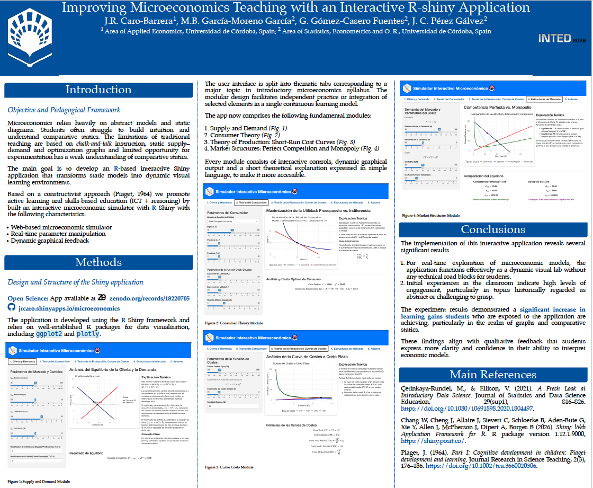

# Improving Microeconomicss Teaching with an Interactive R-Shiny Application - Inted 2026

Material for the INTED Congress 2026

A complete, modular Shiny app which is specifically created for micro-economics teaching and combines multiple topics into a coherent pedagogical framework contributing to learning outcomes related to digital literacy and economic reasoning.

[Link to the Microeconomics application](https://jrcaro.shinyapps.io/microeconomics/) 

